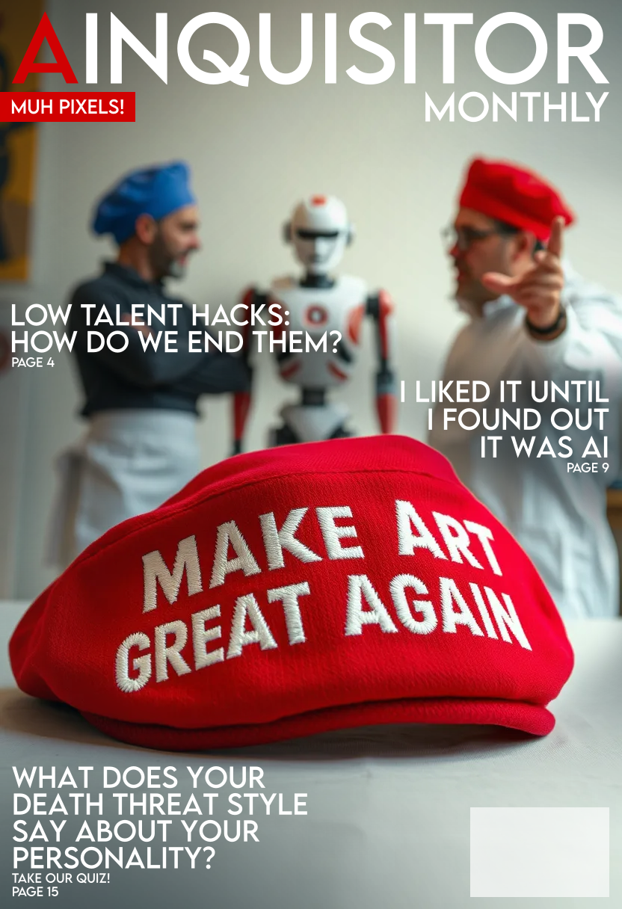
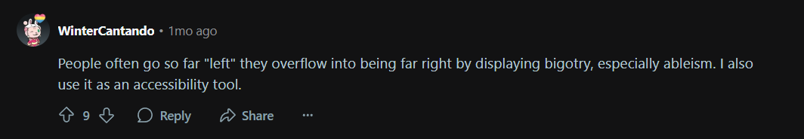
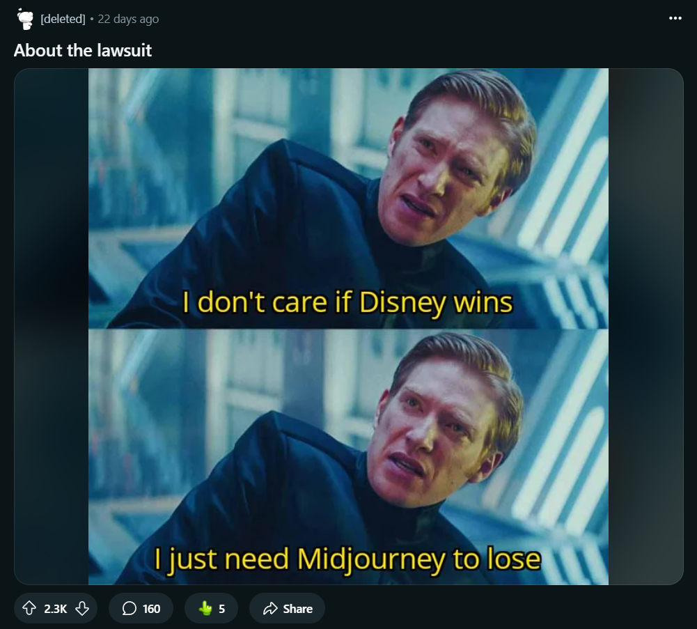
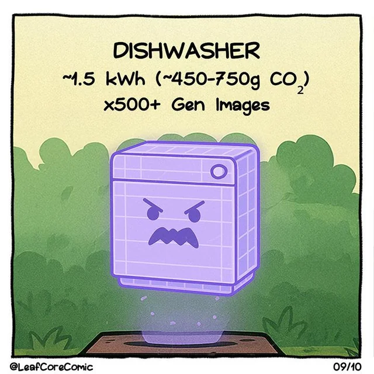
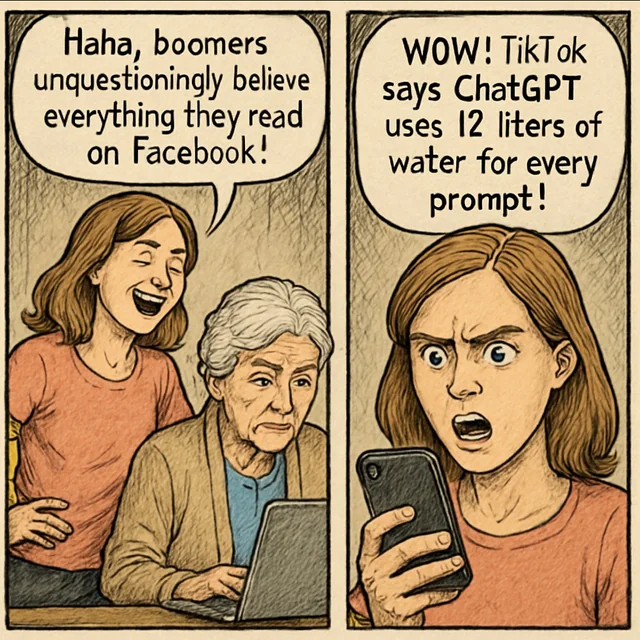

# The Anti-AI Movement: Right-Wing Tendencies and Misguided Activism

## Introduction: Unmasking the Anti-AI Narrative

The burgeoning [anti-AI art movement](https://www.reddit.com/r/antiai/), spanning communities like the "[artist hate](https://www.reddit.com/r/ArtistHate/)" subreddit and various online groups, often [frames itself as a champion of artists' rights](https://www.artistsresist.org/about/) and ethical technology. However, a deeper examination of its tactics, core philosophies, and real-world implications reveals a surprising and disturbing [alignment](https://www.sv.uio.no/c-rex/english/resources/key-consepts-and-questions/what-are-the-psychological-characteristics-of-people-holding-far-right-beliefs.html) with right-wing, protectionist, and even authoritarian ideologies. This article argues that, despite its stated intentions, the movement frequently works against the very progress and individual empowerment [it claims to champion](https://www.reddit.com/r/IronFrontUSA/comments/1k4enmz/aigenerated_content_will_be_removed_as_spam/), inadvertently serving the interests of established corporations and stifling genuine innovation.

## Core Arguments and Evidence

### **1. Fostering Authoritarianism, Stifling Freedom of Expression, and Ableism**

The anti-AI movement exhibits a concerning propensity for authoritarian tactics, actively seeking to control and suppress creative expression, often with shocking ableist undertones.
 * **Suppression of Creative Freedom:** The pervasive online bullying, harassment, and even calls for violence (such as the "[we need to kill AI artists](https://knowyourmeme.com/memes/we-need-to-kill-ai-artist)" meme) demonstrate a willingness to coercively enforce behavioral standards and punish perceived enemies. This aggressive suppression of differing creative approaches and technologies runs counter to fundamental principles of artistic freedom and individual liberty, values generally championed by democratic societies. It aligns more closely with aspects of [Right-Wing Authoritarianism](https://en.wikipedia.org/wiki/Right-wing_authoritarianism) (RWA), which, as described in psychological literature, involves a willingness to coercively enforce behavioral standards and punishment of perceived enemies. Such behavior reflects a desire to dictate what is permissible in art, rather than advocating for a truly open and diverse creative landscape.
 * **Blatant Ableism and Exclusion:** One of the most egregious and often overlooked aspects of the anti-AI movement is its [overt ableism](https://www.reddit.com/r/ableism/comments/1kyey0m/attacked_for_using_ai/). AI tools offer unprecedented accessibility for disabled individuals, enabling them to overcome physical and cognitive barriers in creative expression. For example:
   * **Text-to-Image Generators:** Allow individuals with limited motor skills to create visual art simply using words.
   * **Speech Recognition & Predictive Text:** Empower those with dysgraphia or other communication challenges to translate thoughts into text or create written works.
   * **Audio Descriptions & Tactile Art:** Make visual art accessible to blind and low-vision individuals through AI-generated descriptions and 3D-printable tactile models.
   * **Adaptive Tools:** Personalize art creation tools based on user needs, supporting individuals with various impairments.
   * **Cognitive Support:** AI tools like Goblin Tools (built on ChatGPT) assist neurodivergent individuals with planning, breaking down tasks, and simplifying complex language.
   Despite these profound benefits, members of the anti-AI movement, even within disability communities (as observed on /r/disability), have been documented bullying and shaming disabled individuals for using AI as an accessibility tool. This behavior often invokes a "suffering Olympics" mentality, rejecting the notion that AI can empower disabled artists and effectively prioritizing a narrow definition of "art" over the liberation and creative expression of marginalized groups. This ableism is a shocking contradiction to any claim of advocating for an ethical or inclusive creative world.

### **2. Supporting Corporations (as Useful Idiots)**

Paradoxically, despite often voicing anti-corporate sentiment, the anti-AI movement's actions often inadvertently benefit large corporations by hindering the very technologies that democratize access and power.
 * **Opposing AI as an Equalizer:** Artificial intelligence, particularly in creative domains, serves as a powerful equalizer. Tools and platforms are emerging that allow individual creators and solo entrepreneurs to produce high-quality work and compete with entities that once held monopolies on expensive creative processes. AI is enabling "[solo giants](https://analyticsindiamag.com/ai-trends/solo-giants-list-of-successful-one-person-companies/)" and has the potential to wrest a lot of power away from institutions cloistering information and those with exclusive access to costly forms of expression. By advocating for bans or severe restrictions on accessible AI tools, the movement effectively reduces competition, inadvertently reinforcing the dominance of established corporations who can either navigate complex regulations more easily or invest in proprietary AI models.
 * **Diverting Focus From Real Issues:** The movement's focus on AI developers, who often create tools that empower individuals, distracts from the systemic issues perpetrated by industries like [big oil](https://en.wikipedia.org/wiki/Big_Oil), [the prison industrial complex](https://en.wikipedia.org/wiki/Prison%E2%80%93industrial_complex), [the war industry](https://en.wikipedia.org/wiki/Arms_industry), and [big pharma](https://www.americanprogress.org/article/big-pharma-reaps-profits-hurting-everyday-americans/). This misdirection of energy ultimately serves to divert attention from where genuine corporate accountability is most urgently needed.

### **3. Resisting Technological Progress (A Modern Luddism)**

A defining characteristic of the anti-AI movement is its resistance to technological advancement, a stance inherently at odds with a genuinely [progressive worldview](https://en.wikipedia.org/wiki/Progressivism). The _faux outrage_ regarding job displacement mirrors a Luddite mentality that historically opposed disruptive technologies.
While job displacement is a legitimate concern, the progressive response lies not in stifling innovation, but in implementing [robust social safety nets](https://en.wikipedia.org/wiki/Social_safety_net), retraining programs, and advocating for concepts like Universal Basic Income to support those affected by economic shifts. To blame AI for job losses, instead of a societal system that fails to care for its displaced citizens, is to misdirect anger and halt the collective progress of humanity. A truly progressive perspective embraces technological advancement while simultaneously striving for equitable societal adaptation, rather than resisting change itself.

### **4. Embracing Misinformation and Selective Outrage** 

The anti-AI movement frequently relies on debunked claims and exhibits striking hypocrisy in its moral indignation.

 * **"Equating Learning With Theft":** A cornerstone of their argument, the claim that AI training data constitutes "theft," is largely refuted by legal precedent. Courts have consistently ruled that [web scraping is legal ](https://www.ccn.com/news/technology/openai-wins-court-battle-over-data-copyright/) if you scrape data that is publicly available on the internet. The act of an AI model "learning" from public data is analogous to a human reading a book in a library, a process distinct from illicit appropriation. The widespread acceptance of Google scraping the entire web (including art) for decades to build its search and advertising empire further exposes the selective nature of this outrage. 
* **Repeating Energy Consumption Myths:** Exaggerated claims about AI's energy footprint are routinely debunked by experts. While training large AI models does consume significant energy, general AI applications are often more efficient than traditional methods, and the technology holds immense potential for driving energy efficiency and even developing solutions for climate change. Focusing on this largely misrepresented issue distracts from the more impactful environmental challenges.
 * **Social Media Hypocrisy:** A glaring inconsistency lies in the movement's fervent opposition to AI while largely remaining silent on the extensive data exploitation and societal harms wrought by social media platforms over the past 15 years. This selective focus suggests that the "ethical concerns" arise primarily when AI impacts their specific domain, indicating a self-serving rather than universally applied moral compass.
 * **The "Skill Gap":** The notion of "AI slop" often bandied about by the movement inadvertently reveals a potential underlying issue: a "skill gap" where some artists may be unwilling or unable to adapt to new tools and market dynamics. In competitive fields like art, constant evolution and a high standard of quality are demanded, and railing against new tools rather than improving one's own craft can be seen as an attempt to be "coddled" in a market that already demands excellence.

### **5. "Make Art Great Again" - Calling for Nostalgia and Exclusion**

The rhetoric within some anti-AI circles, particularly the implicit desire to make art great again, echoes a form of cultural conservatism rooted in nostalgia and potentially exclusionary ideals. This framing suggests a belief that art has "fallen" from a past state of glory and needs to be restored by rejecting new forms or technologies. Such a stance can lead to an intolerance of "AI slop" not merely as a matter of quality, but as an existential threat to a perceived "pure" or "traditional" definition of art. This desire to enforce a narrow aesthetic and stifle innovation for the sake of preserving a romanticized past aligns more with conservative values that resist change and often struggle with cultural diversity.

## Conclusion: Beyond the Slop

The anti-AI movement, when viewed through the lens of its actions, methods, and underlying philosophical tenets, reveals a striking divergence from genuinely progressive ideals. Its embrace of authoritarian tactics, its alarming ableism, its unwitting support for corporate power, its resistance to technological progress, its reliance on misinformation, and its nostalgic calls for a return to a past state of "greatness" firmly place it within a spectrum of right-wing, protectionist, and potentially authoritarian movements.

Understanding these dynamics is critically important for fostering a nuanced discussion about AI, one that moves beyond simplistic slogans like "AI slop" and instead focuses on harnessing technology for collective human progress while ensuring robust social safety nets and individual liberty.

_Research assistance by Gemini 2.5_

---

### **Addressing Potential Criticisms and Misconceptions**

**Counter-Argument 1: "But Corporations and the Right are Embracing AI!"**

* **Misconception:** The argument that the embrace of AI by some corporations or right-wing political figures somehow invalidates the analysis of the *anti-AI movement* as having right-wing tendencies.
* **Rebuttal:** AI, much like the internet, electricity, or even basic computing, is a **general-purpose and dual-use technology**. It is a powerful tool with diverse applications, and its utility transcends specific political ideologies.
    * **Technological Neutrality:** AI itself is largely ideologically neutral. It can be developed and wielded by actors across the political spectrum, for a wide array of purposes – from enhancing corporate profits to empowering individual creators, from strengthening surveillance states to facilitating democratic organization. The very fact that bad actors and extremists can leverage AI for their own gains (e.g., creating convincing phishing sites, spreading toxic content, or generating deepfakes for misinformation campaigns, as recent reports have highlighted) strongly *confirms* its neutrality as a tool. A tool's inherent nature is not defined by the intentions of its malicious users, but by its capacity to be used for multiple purposes.
    * **Strategic Adoption:** Smart actors, whether left-leaning or right-leaning, corporate or individual, will naturally seek to leverage powerful new technologies for their respective goals. A corporation embracing AI for efficiency does not make AI inherently "corporate," just as a political party using social media does not make social media inherently "left-wing" or "right-wing."
    * **Distinguishing the Tool from its Users/Opponents:** Our analysis focuses on the *nature and actions of the anti-AI movement*, particularly its methods, philosophy, and practical consequences. It is this opposition movement's characteristics – its resistance to progress, authoritarian tendencies, ableism, embrace of misinformation, and protectionist instincts – that align it with conservative and right-wing elements. The fact that others (including those on the right) see the utility in AI itself is a separate observation and does not contradict the internal analysis of the anti-AI movement's own ideological leanings. Indeed, it often underscores the anti-AI movement's *misjudgment* of the technology's democratizing potential.

**Counter-Argument 2: "Not all critics of AI are right-wing / You're painting with too broad a brush!"**

* **Misconception:** That identifying the anti-AI *movement's dominant characteristics* as right-leaning implies every single individual within it, or every concern about AI, is exclusively right-wing.
* **Rebuttal:** This analysis focuses on the *prevailing ideology and observed tactics* of the organized anti-AI art movement and its most vocal proponents, particularly as manifested in public communities and rhetoric. It acknowledges that:
    * **Legitimate Concerns Exist:** There are genuine and important ethical discussions to be had about AI (e.g., bias in datasets, responsible deployment, job displacement solutions, regulatory frameworks). These nuanced discussions are often distinct from the blanket opposition and aggressive tactics observed within the movement.
    * **Individual Diversity:** Individuals within any broad movement will hold diverse personal political views. However, the *collective behavior, common arguments, and systemic effects* of the anti-AI movement, as detailed in this article, consistently exhibit the identified right-wing tendencies. The analysis targets the *movement as a whole*, not every single participant.

**Counter-Argument 3: "AI Itself Has Left-Leaning Biases / It's a 'Woke' Technology!"**

* **Misconception:** That the observed left-leaning political biases in some large language models (LLMs) (e.g., ChatGPT, as noted by studies from Hoover Institution, PsyPost, and Cato Institute) somehow mean AI itself is inherently left-wing, or that this supports the anti-AI movement's *left-wing* claims.
* **Rebuttal:** While studies indeed indicate that many major LLMs exhibit a left-leaning political bias in their default responses, this is a separate and distinct issue from the anti-AI movement's own ideological alignment.
    * **Data Reflection, Not Inherent Ideology:** This bias primarily stems from the vast datasets on which these models are trained, which often reflect the prevalent biases found in internet text, academic sources, and mainstream media – sources that can indeed lean left. AI models are pattern-matching systems; they reflect the biases in their training data. This is a challenge for responsible AI development, but it doesn't mean the *technology itself* is inherently "woke" or has political agency. It's a mirror, not a political actor.
    * **Configurability:** As some research notes, when prompted to be neutral, AI models can often provide more balanced responses. This demonstrates that while default biases exist, the technology is configurable.
    * **Distinction from Opposition:** The existence of bias in a tool does not define the ideology of those *opposing* the tool. In fact, if anything, this critique of AI's bias often comes from *right-wing* commentators who are concerned about the spread of "liberal talking points." The anti-AI movement, as analyzed in this article, is primarily characterized by its resistance to technological progress and its methods of suppression, which are distinct from concerns about an AI's output bias. The anti-AI movement doesn't generally argue that AI is too "woke"; rather, it argues AI is inherently harmful or illegitimate.

**Counter-Argument 4: "AI Will Lead to an AI Overlord / Existential Risk!"**

* **Misconception:** That the anti-AI movement is justified in its extreme opposition because AI poses an immediate, existential threat to humanity (e.g., Skynet scenarios).
* **Rebuttal:** While discussions about potential long-term, speculative existential risks from advanced AI are valid and occur within academic and safety communities (e.g., LessWrong discussions), this concern is often misrepresented or exaggerated by the anti-AI movement to justify radical opposition.
    * **Current Limitations:** Current AI systems are far from sentient or autonomous. They lack consciousness, common sense, genuine creativity, and the ability to "think" or "feel" like humans. As numerous AI experts and studies confirm, current AI is mathematical and logical processes at work, not a cognizant agent.
    * **Misdirection:** Framing AI as an immediate existential threat often serves as a "moral panic" that distracts from the more tangible, immediate ethical concerns (like bias, privacy, job transition support) and the very real benefits AI offers. It's a fear-based argument that simplifies a complex scientific field into a sci-fi narrative, often used to justify broad opposition rather than nuanced regulation and ethical development.
    * **Human Control:** The focus on "AI overlords" also sidesteps the crucial fact that AI systems are designed, trained, and deployed by *humans*. The focus should be on responsible human governance and ethical guidelines, not on an imagined AI sentience.

**Counter-Argument 5: "AI Doesn't Create 'Real' Art / Lacks Soul!"**

* **Misconception:** That the anti-AI movement's artistic critique (AI lacks soul, true creativity, humanity) is a legitimate, ideologically neutral artistic judgment.
* **Rebuttal:** While aesthetic judgments are subjective, this argument often devolves into an essentialist, romanticized, and ultimately exclusionary view of creativity.
    * **Defining "Art":** Throughout history, new artistic mediums (photography, digital art) have faced similar accusations of lacking "soul" or "true artistry" from traditionalists. The very definition of "art" has always evolved with technology and human ingenuity.
    * **Human Agency in AI Art:** As previously discussed, AI art often involves significant human input, prompting, curation, and refinement. It is a tool that extends human creativity, not an autonomous creator. To deny this is to deny the agency of the human artists who choose to use AI.
    * **Elitism and Exclusion:** This argument frequently serves to maintain an artificial hierarchy, privileging certain methods or outputs and implicitly devaluing or dismissing the creative efforts of those who utilize new tools, including disabled artists who rely on AI for accessibility. This attempts to preserve a perceived artistic class, which aligns with exclusionary, rather than inclusive, values.

**Counter-Argument 6: "AI is Fundamentally Anti-Consent (and therefore unethical)!"**

* **Misconception:** That the use of publicly available data to train AI models is inherently a violation of consent, making AI a fundamentally unethical technology, and that this justifies a blanket opposition to it.
* **Rebuttal:** The accusation of "anti-consent" is a complex one that often conflates different types of "consent" (data privacy vs. copyright usage) and legal interpretations. While legitimate concerns exist regarding data provenance and ethical data collection, the anti-AI movement often weaponizes this argument to paint AI as inherently malicious, ignoring legal precedents and nuanced solutions. More profoundly, this argument often upholds a copyright system that itself can be seen as anti-artist and anti-cultural progress.

    * **"Learning is Not Theft" Revisited (Legality of Public Data):** As previously discussed, established legal rulings and common practice affirm that **web scraping of publicly available data is generally legal** for machine learning purposes. Courts, including the U.S. Copyright Office, have grappled with the nuances of "fair use" in this context. The argument that training on public data is inherently "theft" or a blanket "anti-consent" act, akin to a human learning from publicly available works, has not held up broadly in courts. Publishers and content platforms have long allowed bots to access their sites, and for years, artists uploaded works to platforms with terms of service allowing broad usage (even if the implications for future AI training weren't foreseen).
    * **The Radical Critique: Copyright as "Brain Damage":** A more fundamental left-wing critique, articulated powerfully by artist Nina Paley, posits that **"[Copyright is Brain Damage](https://www.youtube.com/watch?v=XO9FKQAxWZc)"**. From this perspective, the very concept of copyright, particularly in the digital age, acts as a barrier to culture, creativity, and the free flow of information.
        * **Copying as Cultural Progress:** Paley argues that [copying is not theft](https://www.youtube.com/watch?v=IeTybKL1pM4); it is how culture spreads, evolves, and builds upon itself. By restricting copying, copyright stifles the organic, cumulative nature of human creativity.
        * **"Permission Culture" and Censorship:** Copyright fosters a "permission culture" where artists are constantly afraid to create due to the threat of legal action, leading to internal censorship. This directly contradicts the idea of artistic freedom.
        * **Benefits to Corporations, Not Creators:** Paley contends that copyright disproportionately benefits large corporations (like Disney) that can afford to wield its legal power, while often hindering individual artists. It consolidates control over cultural works in the hands of the powerful.
    * **AI as an Accelerator of Cultural Flow:** From this radical perspective, AI's ability to quickly process and remix vast amounts of public cultural data could be seen not as "anti-consent," but as an **acceleration of the natural, unencumbered flow of culture** – a force that breaks down the artificial barriers of copyright that disproportionately benefit corporations and stifle individual creativity. The anti-AI movement's fight against AI on "anti-consent" grounds inadvertently reinforces the very "permission culture" that limits artistic freedom.
    * **Distinguishing Consent Types (Revisited):** While legitimate concerns exist regarding **privacy of personal data (PII)** and the responsible use of sensitive information, these are issues of ethical data governance and robust regulation, not an indictment of AI itself or a justification for blanket prohibition. The critical focus should be on establishing strong privacy frameworks and transparent data sourcing practices, not on maintaining an intellectual property regime that may inherently hinder creative freedom and benefit corporate gatekeepers. The "anti-consent" argument from the movement often seeks to prohibit AI development entirely, rather than advocating for robust **data governance, transparency, and ethical sourcing practices.**

In summary, while the anti-AI movement effectively leverages concerns about consent, particularly around data usage and privacy, it often oversimplifies a complex legal and ethical landscape. Its blanket "anti-consent" accusation often ignores existing legal frameworks, mischaracterizes the nature of AI learning, and, more fundamentally, reinforces a copyright system that a truly progressive view might see as inherently restrictive and pro-corporate. This diversion of energy prevents a focus on *responsible governance and nuanced solutions* in favor of an outright prohibition that would stifle technological progress, individual empowerment, and the free flow of culture.

